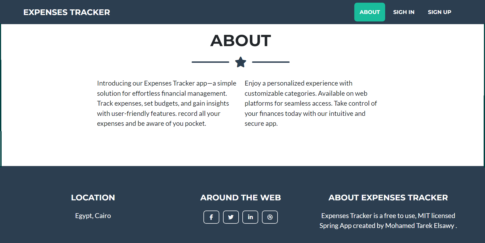
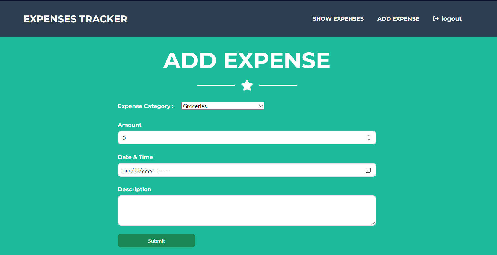

# Expenses Tracker Web App

A full-stack Spring Boot application with MySQL database, containerized with Docker and orchestrated via Docker Compose. Nginx serves as a reverse proxy for seamless request routing.

## 🏗️ Architecture

- **Backend**: Spring Boot 3.2.2 (Java 17)
- **Database**: MySQL 8.0
- **Web Server**: Nginx (reverse proxy)
- **Containerization**: Docker multi-stage builds
- **Orchestration**: Docker Compose

## 📋 Prerequisites

- Docker & Docker Compose installed
- Git installed

## 🚀 Quick Start

### Clone the repository
```bash
git clone https://github.com/thesayam7/Expense-Tracker-Webapp.git
cd Expenses-Tracker-WebApp
```

### Run with Docker Compose
```bash
docker compose up --build
```

The application will be available at:
- **Frontend**: `http://localhost` (via Nginx)
- **Backend API**: `http://localhost:8080` (direct)
- **MySQL**: `localhost:3306`

### Stop the application
```bash
docker compose down
```

## 🔧 Docker Implementation

### Multi-Stage Build
The Dockerfile uses a two-stage build process:
1. **Stage 1 (Builder)**: Maven 3.9 compiles the Java application into a JAR
2. **Stage 2 (Runtime)**: Alpine-based JRE 17 runs the compiled JAR

This approach reduces the final image size by ~80% compared to single-stage builds.

### Services

| Service | Image | Port | Purpose |
|---------|-------|------|---------|
| `java_app` | Custom (multi-stage) | 8080 | Spring Boot application |
| `mysql_db` | mysql:8.0 | 3306 | Expenses database |
| `nginx` | Custom Nginx build | 80 | Reverse proxy |

### Health Checks
All services include health checks:
- **Java App**: HTTP endpoint check every 10s
- **MySQL**: Connection verification every 10s

### Networking
All services communicate via the `expenses-app-nw` bridge network, ensuring isolated and secure container communication.

## 📊 Environment Variables

Configured in `docker-compose.yml`:
- `SPRING_DATASOURCE_URL`: MySQL connection string
- `SPRING_DATASOURCE_USERNAME`: Database user (root)
- `SPRING_DATASOURCE_PASSWORD`: Database password

## 💾 Data Persistence

MySQL data persists in the `java-app-data` volume, ensuring data survives container restarts.

## 🛠️ Development

To rebuild and restart services:
```bash
docker compose up --build
```

To view logs:
```bash
docker compose logs -f java_app
```

To access the database:
```bash
docker compose exec mysql_db mysql -u root -p expenses_tracker
```

## 📝 Key Features

✅ Multi-stage Docker build for optimized images
✅ Docker Compose orchestration with service dependencies
✅ Health checks for reliability
✅ Nginx reverse proxy configuration
✅ Spring Boot with JPA, Security & Validation
✅ MySQL database with automatic initialization
✅ Custom networking for service isolation

---

**Ready to deploy?** Just clone and run `docker compose up --pull always`!

## ScreenShots
 <br>
 <br>
 <br>
 <br>
 <br>
 <br>
 <br>
 <br>

